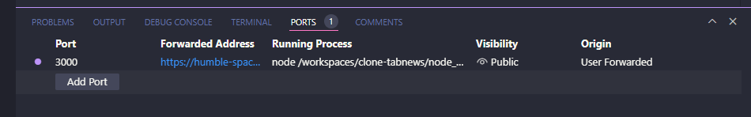

# clone-tabnews

Fui convencido pelo Teló

## num futuro próximo passarei aplicando Markdown pra deixar essa doc menos horrível, por hora segue o baile

# dia 3

```
Checar versão do node
    node -v

Checar versões disponíveis e instalar a específica via "codename"
    nvm ls
    nvm install lts/hydrogen

Aplicar versão padrão do node no ambiente
    nvm alias default lts/hydrogen

Criar arquivos para dependências padrão
  Criar arquivo ".nvmrc" na raiz
    # o conteúdo é a apenas o nome da versão do node
  npm init
    # gera o arquivo package.json onde ficarão as demais dependências

Instalar next e react
  npm install next@13.1.6
  npm install react@18.2.0
  npm install react-dom@18.2.0

Comentários extra curso
  Quebrei o repositório com um commit de 400 mil linhas fazendo push da pasta node_modules
  Foi preciso aprender sobre gitignore
  https://www.freecodecamp.org/news/gitignore-file-how-to-ignore-files-and-folders-in-git/
```

# dia 4

```
Protocolos
HTTP = Hypertext Transfer Protocol
  Define como as informações client/server serão trocadas

FTP = File Transfer Protocol

SMTP = Simple Mail Transfer Protocol

TCP = Transmission Control Protocol
  Possui "Error Recovery" para garantir que a informação no destino final está íntegra

UDP = User Datagram Protocol
  Ideal para realizar tráfego de informações constantes como voz e vídeo mesmo que alguns pacotes se percam, evitando assim, travamentos na transmissão devido a ausência de necessidade de checagem dos pacotes como no caso do TCP
  vídeo de comparação entre TCP e UDP em games
  https://www.youtube.com/watch?v=ZEEBsq3eQmg&ab_channel=Yannick%28yandeu%29

IP = Internet Protocol
```

```
Configurando e executando Next
  criar pasta pages/ na raiz
  criar arquivo index.js dentro de pages/
  obs -> todos os arquivos dentro da pasta pages virarão rotas públicas
  ex, arquivo recuperar-senha.js = site.com/recuperar-senha

Dentro do arquivo package.json, na seção scripts
  criar o seguinte comando
    "dev": "next dev"

Executar o comando no terminal com o nome designado no arquivo anterior
  npm run dev

Deixar o ambiente de desenvolvimento com saída pública
  na aba ports
    right click > port visibility > public
  segue print abaixo
    obs -> por padrão o codespaces utiliza a porta 3000
```



# dia 5

```
Comandos git
  verificar "imagens"/commits do repositório
    git log
    git log --stat
    git log --oneline

  verificar arquivos em que estão no estágio de modified
    git status
  commitar mudanças
    git add . || git add nome_do_arquivo
      adiciona todos os arquivos ou arquivos específicos para o estágio staged
    git commit -m "mensagem com os resumos das alterações"
    git commit -m 'mensagem `aplicarBackground`'
      realiza o commit dos arquivos adicionados
    git commmit --amend
      se for necessário realizar algum ajuste adicional nos arquivos antes do push sem gerar um commit adicional, --amend sem nada puxará o último commit
      usar o --amend em um projeto onde muitas pessos estão alterando os arquivos pode gerar conflitos (com os arquivos e com os colegas)

Estágios dos arquivos
  modified
    todos os arquivos que são modificados durante as sessões de programação
  staged
    arquivos destacados para realização do novo commit, se necessário nem todos os arquivos que foram modificados precisam estar como staged
  commit
    arquivos prontos para serem enviados "de volta ao repositório"
  untracked
    arquivos que não estão sendo rastreados para os demais estágios
    geralmente são arquivos novos que nunca passaram pelo repositório
```

# dia 6

```
Continuação sobre git
  git branch
    verifica as branches existentes no repositório
  git push
    envia os commit locais para o repositório online
  git push -f
    forma criminosa de enviar arquivos, usar com MUITA cautela
    por exemplo, caso um commit tenha sido enviado para o origin mas se faz necessario um amend no mesmo para manter tudo no mesmo commit, pode-se usar o --force
  git pull
    traz os arquivos presentes no origin com os ajustes mais recentes para o local

OBS -> local/main é a branch clonada do github/gitlab...
       origin/main é a branch original presente online
```

# dia 7

```
Primeiro deploy na Vercel realizado com sucesso!
```

# dia 8

```
Modelos orgânico vs impressora 3D
Orgânico
  produção "célula a célula"
  aproveitando erros e acertos
  sentimento de comunidade underground
  reduz overengineering e feature creep

Impressora 3D
  produção direta ao ponto
  sem etapas de feedback
  sentimento de software de engessado
  pode gerar overengineering e feature creep

Ambos modelos tem momentos específicos para aplicação
```

# dia 9

```
Organização de tarefas
Nv1 = Ser lembrado individualmente
  -custo de produção
  -tempo de aquecimento
  Ex: post-its, bullet journal físico

Nv2 = Ser lembrado em grupo
  Ex: Kanban

Nv3 = Expandir conhecimento
  Ex: Jira, Trello

Nv4 = Gerar métricas
  Ex: Timesheet
  Usar métricas para avaliar como o négocio está pulando barreiras ao invés de medir apenas os colaboradores, visão do produto como um todo

Relação tudo vs nada
Organizar corretamente as tarefas, cada uma no seu devido nível pode evitar a analysis paralisys e dar prosseguimento mesmo que com passos pequenos na direção correta rumo à conclusão dos projetos, independente do tamanho/complexidade deles

Milestones(Epics) & Issues(Tasks)
- Gerar épicos com o máximo de tasks possíveis e com o tamanho correto (impossível mensurar com exatidão, mas buscar aproximação máxima)
- Gerar tasks pequenas, a execução de várias delas ao invés uma task maior gera a sensação de avanço de forma mais eficiente
- Nas tasks adicionar pontos entregáveis em formato de checkboxes
```

Exemplo de mensuração de tarefas no todo
| | Semana 1 | Semana 2 | Semana 3 | Semana 4 |
| -------- | ------- | ------- | ------- | ------- |
| Total de tarefas | 50 | 75 | 100 | 140 |
| Executadas | 30 | 50 | 70 | 90 |
| % de conclusão | 60% | 67% | 70% | 64% |

# dia 10

```
Estilização de código(padronização)
Aproveitar a oportunidade de projetos pequenos para padronizar desde o ínicio, evitando vícios de código.
Em casos de bases grandes/legadas de código, rezar pra você não ser o responsável por padronizar tudo kkkk

Para salvar as configurações do editor
  Account > Settings Sync On > Logar com Github

Instalar extensão "EditorConfig for VS Code"
Criar arquivo .editorconfig na raiz
Instalar Prettier apenas pro ambiente de desenvolvimento
  npm install prettier -D
Criar funções do prettier no arquivo package.json na seção scripts
  "lint:check": "prettier --check .",
  "lint:fix": "prettier --write ."
Instalar extensão Prettier
Definir o Prettier como formatador padrão do VSCode
  Settings > Default Formatter
Definir a auto-formatação ao salvar
  Settings > Format on save > Check
Desativar auto save
  Settings > Auto save > off
```

# dia 11

```
DNS = Domain Name System
  Em background  ao acessar um site o computador faz um request direto a um dos servidores root de DNS que converte os nomes dos sites nos IPs reais e retorna-os para o computador, que só ai com o endereço IP acessa o servidor do serviço final
  SERVER DNS <----------> PC <----------> SERVER DO SITE DESEJADO
  https://root-servers.org/

OBS -> os domínios são verificados nos root servers com o endereço invertido e utilizando o o modelo "Fully Qualified Domain Name FQDN" que inclui mais um ponto no fim ficando dessa forma:
  normal = tabnews.com.br.
  root server = .br.com.tabnews
  . inicial = root domain
  br. = Top-Level Domain "TLD"
    ccTLDs = Country Code Top-Level Domains
      .br .ai .ca .pt
    gTLDs = Generic Top-Level Domains
      .com .net .org .dev

Para criar um gTLD é necessário um processo junto a ICANN (Internet Coprporation for Assigned Names and Numbers) para geração personalizada, ex: .bradesco

A propagação dos DNS podem demorar pois é necessário substituir os novos valores no TTL (Time To Live) que é um cache com função de otimizar a velocidade nas requisições
```
